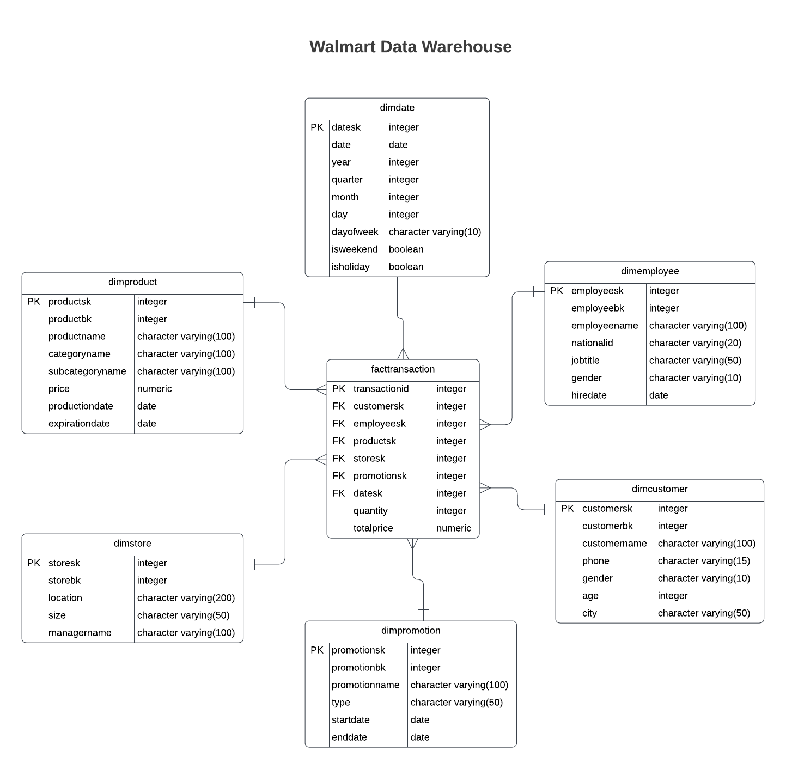

# DataWarehouse Directory

This directory contains SQL scripts to create the PostgreSQL OLAP Data Warehouse for analytics and reporting.

- `facttransaction` renamed to `factsales`

## Contents:
1. `create_user.sql` – Defines the user
2. `create_dwh.sql` – Defines the Star Schema for analytical queries.
3. `DimDate_Table_Population.sql` – Populates the DimDate table with date-related data.
