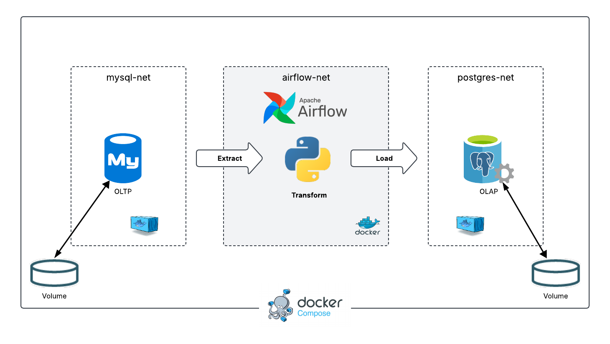

# Walmart Data Warehouse - End-to-End ETL Pipeline



## **Project Overview**  
This project is an end-to-end **ETL (Extract, Transform, Load) pipeline** for a **Walmart-like retail store**. It involves extracting transactional data from a **MySQL OLTP database**, transforming it using **Apache Airflow & Python**, and loading it into a **PostgreSQL OLAP Data Warehouse** for analysis.  

The goal is to enable **business intelligence (BI) reporting** by analyzing **customer purchasing patterns**, identifying **frequently bought together items**, and optimizing business strategies.  

---

## **Tech Stack**
- **MySQL** – Source OLTP Database  
- **PostgreSQL** – Target OLAP Data Warehouse  
- **Apache Airflow** – ETL Orchestration  
- **Python** – Data Transformation  
- **Docker & Docker Compose** – Containerization  
- **SQL** – Data Modeling & Querying  
- **Pandas & NumPy** – Data Analysis  

---

## **Project Architecture**  
The project follows a **three-layer architecture**:  

1. **OLTP Database (MySQL)**
   - Stores raw transactional data from the retail system.  

2. **ETL Pipeline (Airflow & Python)**
   - Extracts data from MySQL.  
   - Transforms and processes the data.  
   - Loads it into the OLAP Data Warehouse.  

3. **OLAP Data Warehouse (PostgreSQL)**
   - Stores structured data for analytical queries.  

---

## **Setup Instructions**
### **1. Clone Repository & Setup**
```bash
git clone https://github.com/Ahmed-Naserelden/Walmart-Data-Warehouse-End-to-End-ETL-Pipeline.git

cd Walmart-Data-Warehouse-End-to-End-ETL-Pipeline
```

### **2. Run Setup Script**
```bash
chmod +x setup.sh
./setup.sh
```
```bash
source .env
```

### **3. Start Services with Docker Compose**
```bash
cd Airflow/
docker-compose up -d
```

### **4. Create Transactional Database**
1. Connect to MySQL:
2. Run SQL scripts from the **Transactional Database** directory.

### **5. Create Data Warehouse**
1. Connect to PostgreSQL:
2. Run SQL scripts from the **DataWarehouse** directory.

### **6. Access Services**
- **Airflow UI:** [http://localhost:8080](http://localhost:8080)  
- **PostgreSQL:** Connect via `localhost:5432`  
- **MySQL:** Connect via `localhost:3306`  

---

## **ETL Workflow**
1. **Extract:** Data is pulled from MySQL using Python scripts.  
2. **Transform:** Data cleaning, aggregation, and schema adjustments.  
3. **Load:** Data is inserted into PostgreSQL for reporting.  
4. **Analysis:** SQL queries are run to extract business insights.  

---

## **Business Insights Like:**
### **1. Top-Selling Products**
```sql
SELECT productname, SUM(quantity) AS total_sold
FROM factsales
JOIN dimproduct ON factsales.productsk = dimproduct.productsk
GROUP BY productname
ORDER BY total_sold DESC
LIMIT 10;
```

### **2. Customer Spending by Gender**
```sql
SELECT gender, AVG(totalprice) AS avg_spent
FROM factsales
JOIN dimcustomer ON factsales.customersk = dimcustomer.customersk
GROUP BY gender;
```

### **3. Frequently Bought Together**
```sql
SELECT p1.productname AS product_1, p2.productname AS product_2, COUNT(*) AS freq
FROM factsales f1
JOIN factsales f2 ON f1.transactionid = f2.transactionid AND f1.productsk < f2.productsk
JOIN dimproduct p1 ON f1.productsk = p1.productsk
JOIN dimproduct p2 ON f2.productsk = p2.productsk
GROUP BY product_1, product_2
ORDER BY freq DESC
LIMIT 10;
```

---

## **Contributing**
Feel free to fork this repository, open an issue, or submit a pull request with improvements.  
